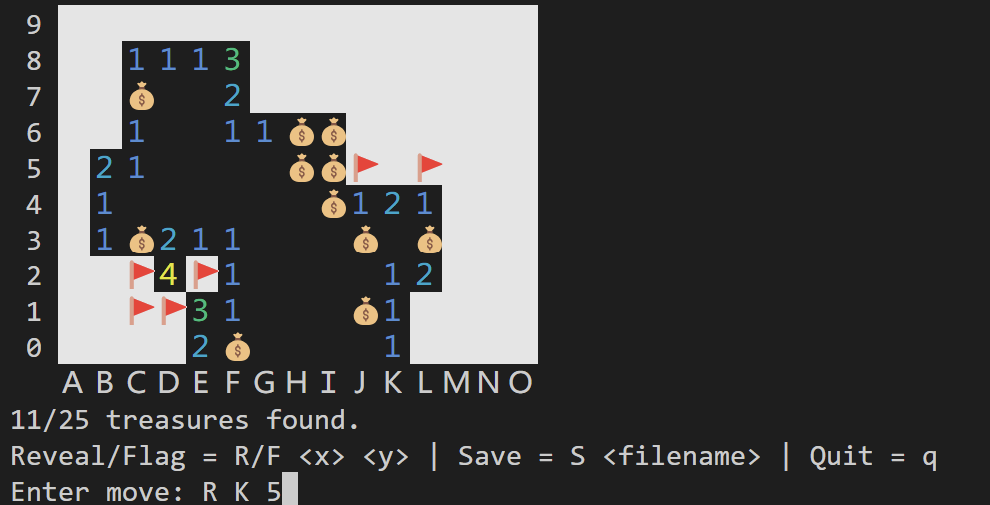

# pirate-treasure

A pirate-themed game of logical deduction.



## How to Play

The game is played on a grid. Some cells are empty while others contain treasures or traps. The contents of cells are initially hidden. Reveal all treasures while avoiding any traps to win the game. If you suspect a trap, mark it with a flag.

### Running the Game

First, compile with `make pirate.exe`.

Then, run with `./pirate.exe` and desired arguments.

For example, to start a new game with the desired width, height, number of treasures, and number of traps:

```console
./pirate.exe <width> <height> <num_treasures> <num_traps>
```

Or, to load a saved game from a file:

```console
./pirate.exe <filename>
```

### Command Interface

The default game interface reads commands from `stdin`:

- `R <x> <y>`: Reveal the contents of the cell at position (x, y).
- `F <x> <y>`: Toggle the flag marker at position (x, y).
- `S <filename>`: Save the current game to a file. 
- `Q`: Quit the game.

### Keyboard Interface

The game also provides an alternate keyboard interface.

You may need to install the `ncurses` library to use the keyboard interface. On WSL/Ubuntu, you can install it with:

```console
sudo apt-get install libncurses5-dev
```

On macOS, you can install it with:

```console
brew install ncurses
```

Compile with `make pirate-keyboard.exe` and run with `./pirate-keyboard.exe` (and desired arguments, as described above).

- `Arrow keys`: Move the cursor.
- `Space`: Reveal the contents of the cell at the cursor.
- `F`: Toggle the flag marker at the cursor.
- `Q`: Quit the game.

The keyboard interface is an unfinished proof-of-concept. Some features, such as detecting the end of the game or saving the game to a file are not yet implemented.

## Unit Tests

Unit tests for the `Game` ADT are provided in `Game_tests.cpp`. Compile and run them with:

```console
make Game_tests.exe
./Game_tests.exe
```
